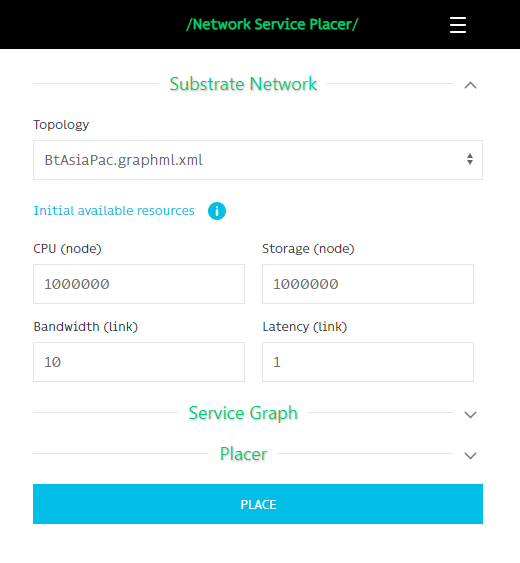
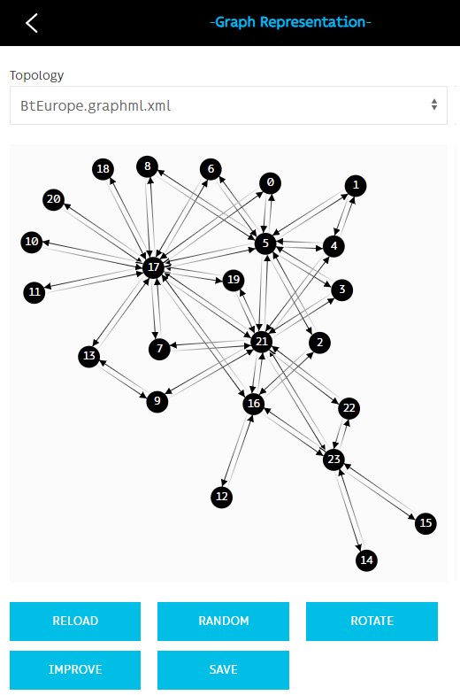
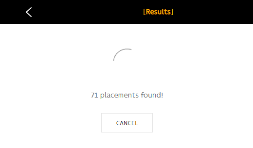
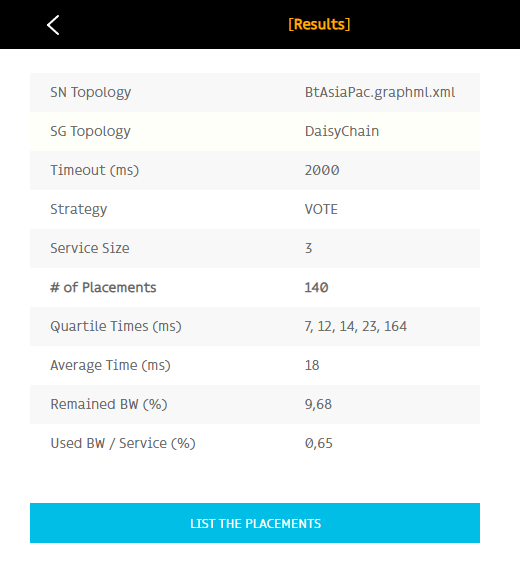
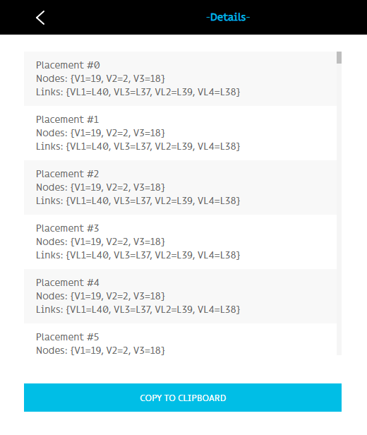
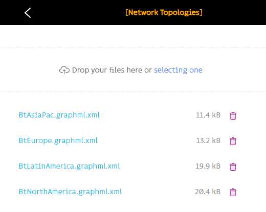

# Network Service Placer

===============================================================================

*This file is part of Network Service Placer.*

*Copyright 2021-2022 b<>com. All rights reserved.*

*Network Service Placer is free software: you can redistribute it and/or modify it under the terms of the GNU General Public License as published by the Free Software Foundation, either version 3 of the License, or (at your option) any later version.*

*Network Service Placer is distributed in the hope that it will be useful, but WITHOUT ANY WARRANTY; without even the implied warranty of MERCHANTABILITY or FITNESS FOR A PARTICULAR PURPOSE. See the GNU General Public License for more details.*

*You should have received a copy of the GNU General Public License along with Network Service Placer. If not, see <https://www.gnu.org/licenses/>.*

===============================================================================

Network Service Placer is a tool, developed to facilitate the evaluation of different online service placement algorithms over the network. It can also be used to evaluate routing algorithms, topology abstractions and other subjects relevant to this context.

## Technologies used for the service (back-end)

* Spring Framework (as the framework)
* Apache Maven (as the build automation tool)
* Apache Tomcat
* Data Persistence with JPA and Hibernate
* Apache Commons (Download / Upload files)
* Jackson (Data-bind)

## Technologies used for the web-based user interface (front-end)
* HTML
* CSS (UIKit)
* Javascript (jQuery, UIKit)
* Features
  * API connection via HTTP Requests over JSON data format
  * Responsive (Desktop and Mobile compatible)

## How to use
1. Build the application with maven and generate executable jar file.
```
mvn package -DskipTests
```
2. Run application with java.
```
java -jar target/nsplacer.jar
```
3. Use Chrome or Firefox, and open the address [https://127.0.0.1/](https://127.0.0.1/) 
4. Sign-in with username=guest and password=guest

## About
Masoud Taghavian (masoud.taghavian@gmail.com)

## Screenshots












